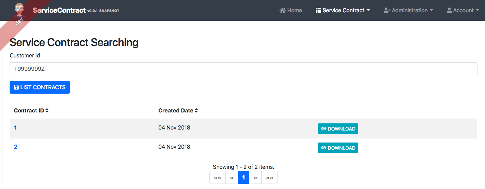

# Service Contract

## Technical detail design
This document provide the detail design for Simplified Contract system.

### Requirement
Please refer to Simplified Contract specification -  SR1234568Q, project code P00001

### Design decisions
1. Database: 
    - Production: MySQL 
    - Development: H2

    Both H2 and SQLite is a SQL database that runs in embedded mode, either in memory or saved as a file. The reason we don't use SQLite for development is because Hibernate does not provide a dialect for SQLite and Spring Boot doesn't work out of the box with SQLite (as it does for example with H2, HSQL or Apache Derby) 
2. Using Liquibase to handle sql script.    
3. Backend: Java, Springboot, JPA
4. Front end: Angular 6. Angular 1.x is good but it will be better if we use the newer vrsion for building new application.
5. Using Jhipster to generate the structure of project. JHipster is a development platform to generate, develop and deploy Spring Boot + Angular Web applications and Spring microservices. 

### Low level design
#### Database
##### Table: contract
| Field | Data type | Key | Note |
| ----- | --------- | --- | ---- |
| Id | bigint | PK | Not null, autoIncrement |
| customer_name | varchar(200) |  |  |
| customer_age | integer |  |  |
| customer_doc_id | varchar(64) |  |  |
| content | longblob |  |  |
| content_content_type | varchar(50) |  |  |
| created_by | varchar(50) |  |  |
| created_date | timestamp |  |  |
| last_modified_by | varchar(50) |  | defaultValueComputed="CURRENT_TIMESTAMP" |
| last_modified_date | timestamp |  | defaultValueComputed="CURRENT_TIMESTAMP" |

##### Table: product
| Field | Data type | Key | Note |
| ----- | --------- | --- | ---- |
| Id | bigint | PK | Not null, autoIncrement |
| product_type | varchar(100) |  |  |
| commitment | integer |  |  |
| price | float |  |  |
| name | varchar(255) |  |  |
| device | varchar(100) |  |  |
| service_id | varchar(64) |  |  |
| contract_id | bigint | FK | reference table: contract(id) |

##### Table: vase
| Field | Data type | Key | Note |
| ----- | --------- | --- | ---- |
| Id | bigint | PK | Not null, autoIncrement |
| name | varchar(500) |  |  |
| product_id | bigint | FK | reference table: product(id)  |

 #### APIs
 ##### End point 1: Generate Contract
 ###### API
This api will receive the Customer inforamtion and card detail to generate the contract

| Field | Data type |
| ----- | --------- |
| URL | /api/service-contract |
| Method | POST |
| Request Body | Refer to RequestBody |
| Response Body | refer to ResponseBody |

> RequestBody:
> ```javascript
> {
>   "customerInfo": {
>     "age": 0,
>     "docId": "string",
>     "name": "string"
>   },
>   "products": [
>     {
>       "commitment": 0,
>       "device": "string",
>       "name": "string",
>       "price": 0,
>       "serviceId": "string",
>       "type": "string",
>       "vases": [
>         {
>           "vas": "string"
>         }
>       ]
>     }
>   ]
> }
> ``` 

> Response Body
> ```javascript
> {
>   "content": "string",
>   "contentContentType": "string",
>   "createdDate": "2018-11-03T08:47:48.214Z",
>   "customerAge": 0,
>   "customerDocId": "string",
>   "customerName": "string",
>   "id": 0,
>   "products": [
>     {
>       "commitment": 0,
>       "contract": {},
>       "device": "string",
>       "id": 0,
>       "name": "string",
>       "price": 0,
>       "productType": "string",
>       "serviceId": "string",
>       "vases": [
>         {
>           "id": 0,
>           "name": "string",
>           "product": {}
>         }
>       ]
>     }
>   ]
> }
> ```

###### Sequence Diagram

                    

##### End point 2: Retrive list of contract
 ###### API
Get the list of contracts for a customer based on the customer id

| Field | Data type |
| ----- | --------- |
| URL | /api/service-contract |
| Method | GET |
| Request query | customerDocId.equals={Customer Doc Id} |
| Response Body | refer to ResponseBody |


> Response Body
> ```javascript
> [
>   {
>     "content": "string",
>     "contentContentType": "string",
>     "createdDate": "2018-11-03T08:47:48.200Z",
>     "customerAge": 0,
>     "customerDocId": "string",
>     "customerName": "string",
>     "id": 0
>   }
> ]
> ```

###### Sequence Diagram

                    

## Development

Before you can build this project, you must install and configure the following dependencies on your machine:

1. [Node.js](https://nodejs.org): We use Node to run a development web server and build the project.
   Depending on your system, you can install Node either from source or as a pre-packaged bundle.
2. [Yarn](https://yarnpkg.com): We use Yarn to manage Node dependencies.
   Depending on your system, you can install Yarn either from source or as a pre-packaged bundle.
3. Jdk 1.8.x
4. Maven with latest version

## How to build and run application

1. Clone project from [https://github.com/chaumin/service-contract](https://github.com/chaumin/service-contract)
2. Install dependencies for front end part(Each time you change the [package.json](package.json), you should run this command again.
```
    yarn install
```
3. Build and start server for backend part.
```
    ./mvnw
```

## How to use application
1. Access application by access the URL [http://localhost:8080](http://localhost:8080)


2. Login to system using username and password is admin/admin


3. Create a Contract, you can use Postman or Swagger provided by system. To access swagger, click on [Administration]() menu, and then select [API]().

    From the Swagger screen, click on [contract-resource]() and then click on [POST /api/service-contract]().

    Input value for required parameter (json object have been mentioned in API section) or you can click on the [Excempla value](), system will automatically genrate the example json for you. 
    
    Click on [Try it out!]() to send request
 

4. Search contract
    Click on [Service Contract]() menu and then [Search]()


5. Download Contract
    
    From Search Contract result, click on download to open the Contract in a new tab with PDF format, from there you can view or download to your local maachine

6. How to access H2 database

    Click on [Administraction]() menu and then [Database](), system will open new tab, from there you can doing the query.

    Click [Connect]() to connect to DB (no need to input password)
    